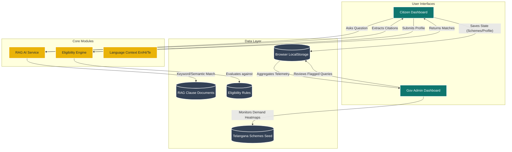

# Sahayak — AI Government Scheme Navigator 🏛️✨

[](https://reactjs.org/)
[](https://vitejs.dev/)
[](https://tailwindcss.com/)
[](https://opensource.org/licenses/MIT)

**Sahayak** is a source-grounded, multilingual conversational AI platform designed to help Indian citizens discover, understand, and apply for government welfare schemes they qualify for. 

Built initially for **Telangana State Government Schemes**, Sahayak bridges the "awareness-to-action" gap by translating complex bureaucratic criteria into personalized, actionable guidance—while providing government administrators with anonymized telemetry to gauge policy demand.

---

## 🌟 Key Features

1. **Deterministic Eligibility Engine** 🎯
   - Citizens fill out a simple 7-field demographic profile.
   - The engine deterministically evaluates the profile against official scheme rules (age, income, caste, etc.) to guarantee 100% accurate matches.
2. **Source-Grounded AI Assistant (RAG)** 🤖
   - Ask natural language questions like *"Am I eligible for a scholarship if my father is a farmer?"*
   - Responses are strictly grounded in official clause documents. Every claim cites the exact government rule. 
   - **Zero Hallucination Guarantee:** If confidence falls below 72%, the AI gracefully falls back and routes the user to the official portal.
3. **Multilingual Support** 🌍
   - Real-time UI and AI response translation across **English, Hindi, and Telugu**.
4. **Interactive Document Checklists** 📄
   - Automatically generates personalized, interactive checklists for required certificates (e.g., Income, Caste, Bonafide) with issuing authority notes.
5. **Government Telemetry Dashboard** 📊
   - A dedicated Admin view tracking district-level demand heatmaps, top-searched schemes, and the critical "awareness-to-action" gap (high match vs. low application rate).

---

## 🏗️ System Architecture

Sahayak operates entirely on the client side for this demo, utilizing local storage for state persistence and a local keyword-based RAG matching service.



---

## 🛠️ Tech Stack

- **Framework**: [React 18](https://react.dev/) + [Vite](https://vitejs.dev/)
- **Styling**: [Tailwind CSS v3](https://tailwindcss.com/)
- **Routing**: [React Router v6](https://reactrouter.com/)
- **Icons**: [Lucide React](https://lucide.dev/)
- **Language**: Pure JavaScript (ES6+) and JSX (No TypeScript)

---

## 📂 Project Structure

```text
Sahayak_gov/
├── index.html                 # Vite entry HTML
├── vite.config.js             # Vite configuration
├── tailwind.config.cjs        # Tailwind utility classes config
├── package.json               # Dependencies and scripts
└── src/
    ├── main.jsx               # React DOM rendering entry point
    ├── App.jsx                # Root component & Route definitions
    ├── index.css              # Global styles & custom animations
    ├── components/            # Reusable UI (Header, SchemeCard, Citations)
    ├── context/               # React Context (LanguageProvider)
    ├── lib/
    │   ├── engine/            # Deterministic matcher logic (eligibilityMatcher.js)
    │   ├── rag/               # AI grounded search logic (ragService.js)
    │   ├── seed/              # Seed data: 16 Schemes, Rules, RAG clauses
    │   └── i18n/              # Translation dictionaries
    └── pages/                 # Route views (Landing, Auth, Chat, Admin, etc.)
```

---

## 🚀 Getting Started (Local Development)

### Prerequisites
Make sure you have [Node.js](https://nodejs.org/) (v18 or higher) and npm installed on your machine.

### Installation

1. **Clone the repository**
   ```bash
   git clone https://github.com/saswatdutta1310/Sahayak_gov.git
   cd Sahayak_gov
   ```

2. **Install dependencies**
   ```bash
   npm install
   ```

3. **Start the development server**
   ```bash
   npm run dev
   ```

4. **Open in Browser**
   Navigate to `http://localhost:5173/` to view the application.

---

## 💻 Demo Roles

When you launch the app, click **"Log In"** on the top right, and use the quick demo shortcuts:
- **Citizen Demo (Rani - Student):** Automatically logs you in with a pre-filled profile (Female, 20, Student, SC category, 1L-2L income) to instantly demonstrate matched schemes like *Kalyana Lakshmi* and *Post-Matric Scholarships*.
- **Government Official Demo (Admin):** Logs you into the Admin Analytics Dashboard to view telemetry, demand heatmaps, and the human review queue.

---

## 🔒 Privacy & Security Note

Sahayak is built with a **strict privacy-first architecture**. 
- No Aadhaar, PAN, or sensitive National ID data is ever collected or required to evaluate eligibility. 
- The eligibility engine operates entirely on anonymized, high-level demographic buckets (e.g., Income Bands, Age, Social Category).

---

<p align="center">
  <i>Built with ❤️ for Indian e-Governance Hackathons.</i>
</p>
